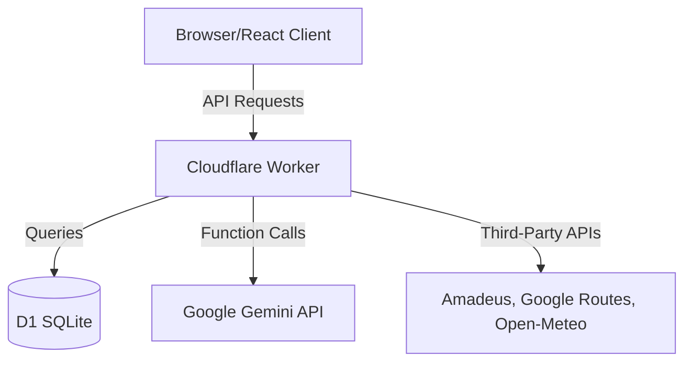

# System Architecture
## Project Name: YATRA-AI

This document outlines the high-level architecture and technical stack that powers YATRA-AI.

### 1. Architectural Overview

YATRA-AI is designed as an edge-first, AI-driven web application. It combines a highly responsive Single Page Application (SPA) on the frontend with serverless edge functions on the backend. This architecture minimizes latency by computing logic and serving data close to the end user.

### 2. Frontend Layer

The frontend is a React-based SPA optimized for fast routing and a premium user experience.

- **Routing:** A custom lightweight router inside `src/App.tsx` efficiently loads views based on the current URL path.
- **State Management:** Global application state is managed via React Context (`src/store.tsx` -> `useYatra`). The `mutate` function handles client-side updates while simultaneously syncing with the backend, allowing for optimistic UI updates.
- **Component Structure:**
  - `src/components/`: Reusable, generic UI primitives (buttons, layout shells, modals).
  - `src/features/`: Complex, domain-specific modules (e.g., `explore.tsx`, `business.tsx`, `planner.tsx`).

### 3. Backend & API Layer

The backend executes on the edge using Cloudflare Workers. It acts as an API gateway, processing requests, authenticating users, and orchestrating calls to external providers.

- **Main Controller (`src/server/controller.ts`):** The primary router for the API. It intercepts `/api/*` endpoints (like `/api/auth`, `/api/assistant`, `/api/state`), processes payloads, and delegates work to specific modules.
- **Service Providers (`src/server/providers.ts`):** Abstractions for external services. Includes robust caching mechanisms (`service_cache` table) to prevent excessive API calls to third-party endpoints.
- **Authentication:** Custom token-based or cookie-based authentication handling isolated demo sessions versus authenticated business/admin profiles.

### 4. Database Layer

YATRA-AI utilizes **Cloudflare D1**, a serverless SQLite database, ensuring ultra-low latency reads and writes at the edge.

- **ORM:** The project uses **Drizzle ORM** for type-safe database interactions and schema migrations.
- **Schema (`src/server/db.ts`):** Data is structured to support users, trips, itinerary items, business profiles, and hyper-local offers.
- **Data Fetching:** Direct SQL queries and Drizzle operations are mixed to optimize performance for complex spatial and relational data (e.g., proximity-based offers).

### 5. AI Integration (Google Gemini)

Gemini acts as the cognitive engine for YATRA-AI. It is not just a chatbot, but a core piece of the business logic.

- **Structured Output Generation:** Used heavily to parse unstructured travel preferences into deterministic JSON itineraries that the UI can confidently render.
- **Dynamic Routing (Assistant):** The chat assistant utilizes function-calling patterns (enforced by JSON schema requirements) to understand the user's intent and dynamically route them to specific app URLs (e.g., `/stays`, `/passport`).
- **Computer Vision:** Gemini Vision powers the "Visual Lens" feature, enabling users to upload images of monuments, menus, or signboards, and instantly receiving historical context, translations, or safety information.

### 6. Deployment & Environment

- **Infrastructure:** Cloudflare ecosystem (Pages for the static frontend bundle, Workers for the backend API, D1 for the database).
- **Environment Variables:** All secrets (API Keys for Gemini, Amadeus, Razorpay, etc.) are managed securely via Cloudflare Worker bindings and injected into the runtime environment. In local development, they are read via `.dev.vars` or standard environment variables.
